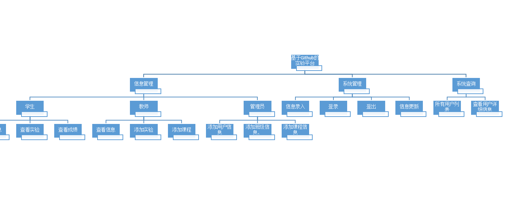
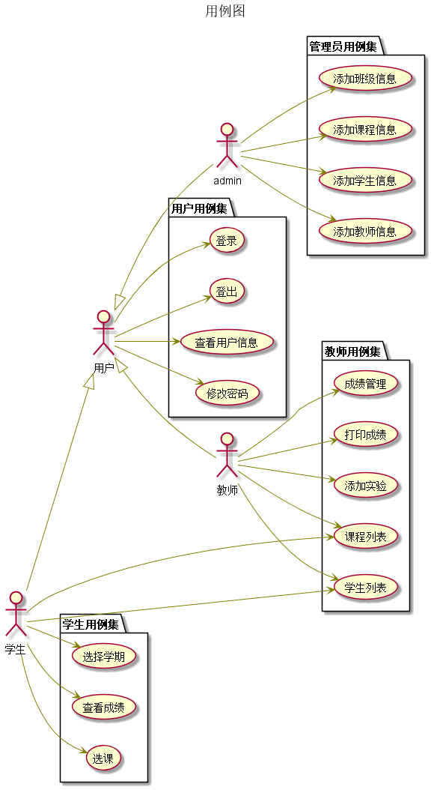

## 期末实验：基于Github的实验管理平台

|学号|班级|姓名|
|:---------------:|:------------:|:------------:|
|201510511129|软件15-1|陈相镇|

 1 概述
-----
* 学生的功能主要有：
    * 查看自己的成绩
    * 修改自己的账户
    * 选择课程
    * 提交作业
* 老师的功能主要有：
    * 查看学生信息
    * 批改学生作业
    *  管理学生的成绩
* 管理员：
    * 管理新用户的信息
    * 负责更新系统信息
* 系统自动计算每个学生的所有实验的平均分。
* 老师和学生都能通过本系统的链接方便地跳转到学生的每个GitHUB实验目录，以便批改实验或者查看实验情况。

2 系统结构图
-------
 

 [界面设计](https://chenxiangz.github.io/is_analysis/FinalTest/ui/login_html.html)
3.用例设计图 [源码](./src/用例图.puml)
-----------------------
###### 基于Github的实验管理平台--用例图

4.类图设计  [源码](./src/类图.puml)
---------------------------
###### 基于Githnb的实验管理平台--类图

5.数据库设计
-------
* 参照数据库设计
    * 学期表：[点击查看](./数据库设计/学期表.md)
    * 学生表：[点击查看](./数据库设计/学生表.md)
    * 实验表：[点击查看](./数据库设计/实验表.md)
    * 成绩表：[点击查看](./数据库设计/成绩表.md)
    * 教师表：[点击查看](./数据库设计/教师表.md)
    * 班级表：[点击查看](./数据库设计/班级表.md)
    * 管理员：[点击查看](./数据库设计/管理员.md)
    * 课程表：[点击查看](./数据库设计/课程表.md)

6.用例及界面详细设计
-----------
*   学生信息管理  [用例](./用例/学生信息管理.md)，[界面](https://chenxiangz.github.io/is_analysis/FinalTest/ui/学生信息管理.html)
*   学生实验提交  [用例](./用例/学生实验提交.md)，[界面](https://chenxiangz.github.io/is_analysis/FinalTest/ui/实验提交.html)
*   学生成绩查询  [用例](./用例/学生成绩查询.md)，[界面](https://chenxiangz.github.io/is_analysis/FinalTest/ui/成绩查询.html)
*   学生成绩管理  [用例](./用例/学生成绩管理.md)，[界面](https://chenxiangz.github.io/is_analysis/FinalTest/ui/成绩管理.html)
*   实验选择    [用例](./用例/实验选择.md)，[界面](https://chenxiangz.github.io/is_analysis/FinalTest/ui/实验选择.html)
*   用户信息    [用例](./用例/用户信息.md)，[界面](https://chenxiangz.github.io/is_analysis/FinalTest/ui/用户信息.html)
*   用户例表    [用例](./用例/用户例表.md)，[界面](https://chenxiangz.github.io/is_analysis/FinalTest/ui/用户列表.html)
*   用户首页    [用例](./用例/用户首页.md)，[界面](https://chenxiangz.github.io/is_analysis/FinalTest/ui/用户首页.html)
*   登出  [用例](./用例/登出用例.md)，[界面](https://chenxiangz.github.io/is_analysis/FinalTest/ui/登出.html)
*   登录  [用例](./用例/登录用例.md)，[界面](https://chenxiangz.github.io/is_analysis/FinalTest/ui/登录.html)
*   选课  [用例](./用例/选课.md)，[界面](https://chenxiangz.github.io/is_analysis/FinalTest/ui/选课.html)
*   添加学生信息  [用例](./用例/添加学生信息.md)，[界面](https://chenxiangz.github.io/is_analysis/FinalTest/ui/添加用户信息.html)
*   添加教师信息  [用例](./用例/添加教师信息.md)，[界面](https://chenxiangz.github.io/is_analysis/FinalTest/ui/添加用户信息.html)
*   添加班级信息  [用例](./用例/添加班级信息.md)，[界面](https://chenxiangz.github.io/is_analysis/FinalTest/ui/添加班级信息.html)
*   添加课程信息  [用例](./用例/添加课程信息.md)，[界面](https://chenxiangz.github.io/is_analysis/FinalTest/ui/添加课程信息.html)