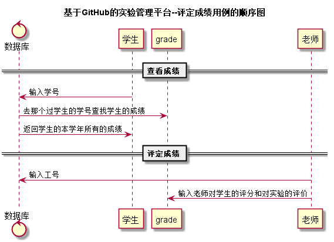

学生成绩管理用例
--------
[点击返回](..\README.md)

1 用例规约
------
|用例名称|学生成绩管理|
|:---:|:---:|
|功能|教师批改学生的实验作业，并提交自己的评论|
|参与者|教师|
|前置条件|学生按时在平台上提交了作业|
|后置条件|无|
|主流事件|教师批改学生提交的作业|
|备选流事件|无|

2 业务流程
------

3 界面设计
------
* 界面参照[点击]()
* API接口
    * [点击](../接口/setStugrades.md)

4 算法描述
------

5 参照表
-----

   * 学期表：[点击查看](../数据库设计/学期表.md)
   * 学生表：[点击查看](../数据库设计/学生表.md)
   * 实验表：[点击查看](../数据库设计/实验表.md)
   * 成绩表：[点击查看](../数据库设计/成绩表.md)
   * 教师表：[点击查看](../数据库设计/教师表.md)
   * 班级表：[点击查看](../数据库设计/班级表.md)
   * 管理员：[点击查看](../数据库设计/管理员.md)
   * 课程表：[点击查看](../数据库设计/课程表.md)
