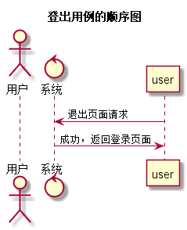

登出用例
----
[点击返回](../README.md)

1 用例规约
--
|用例名称|登出|
|:---:|:---:|
|功能|用户退出Github的实验平台|
|事件参与者|学生、老师|
|前置条件|学生或者老师成功登录了平台|
|后置条件|	登出后，跳转到登录页面|
|主流事件|系统清除客户端登录信息（Cookie）|
|备选事件流|用户长时间已登录，但未进行任何操作， 系统默认退出，系统清除异常的客户端消息（cookie）|

2 业务流程
------

3 界面设计
------
 * 界面参照：[点击](https://chenxiangz.github.io/is_analysis/FinalTest/ui/登出.html)
 * API接口调用：\
    * [点击](../接口/loginOut.md)

4 算法描述
-------------

5 参照表
-----

 * 学期表：[点击查看](../数据库设计/学期表.md)
 * 学生表：[点击查看](../数据库设计/学生表.md)
 * 实验表：[点击查看](../数据库设计/实验表.md)
 * 成绩表：[点击查看](../数据库设计/成绩表.md)
 * 教师表：[点击查看](../数据库设计/教师表.md)
 * 班级表：[点击查看](../数据库设计/班级表.md)
 * 管理员：[点击查看](../数据库设计/管理员.md)
 * 课程表：[点击查看](../数据库设计/课程表.md)