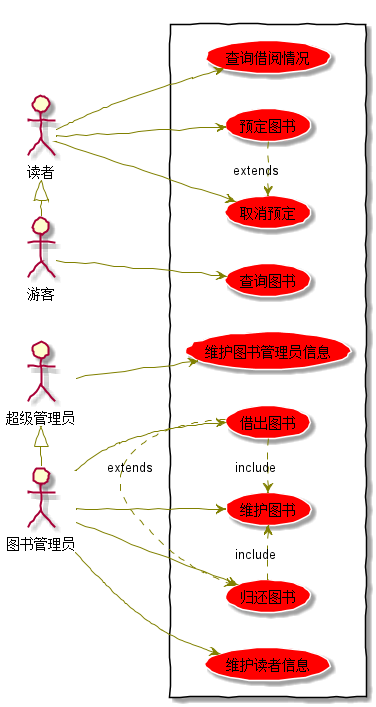
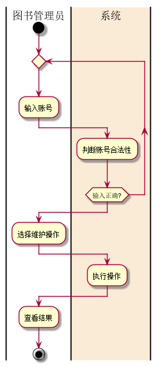

15软工一班-陈相镇实验项目
--
<table>
<tr>
    <th width=100%, bgcolor=withe >姓名</th>
    <th width=40%, bgcolor=withe>学号</th>
    <th width="50%", bgcolor=withe>班级</th>
  </tr>
  <tr>
      <th width=100%, bgcolor=withe >陈相镇</th>
      <th width=40%, bgcolor=withe>201510414104</th>
      <th width="50%", bgcolor=withe>2015级软件工程1班</th>
    </tr>
</table>

实验二、图书管理系统流程
------------
#### 用例说明
游客：只具有查询图书的功能\
读者：拥有查阅图书、归还图书、预定图书、取消预定的功能\
图书管理员：维护图书信息、读者信息、图书的借阅和归还\
超级管理员：维护图书管理员，并且拥有所有图书管理员的功能\
系统：处理所有的用户请求和管理员请求\
#### 流程图一 借出图书
###### 源代码
```
@startuml
|图书管理员|
start
repeat
	:输入账号;
|#AntiqueWhite|系统|
	:判断账号合法性、正确性;
repeat while (输入正确)
|图书管理员|
repeat
	:输入借出账号;
	|系统|
	:判断账号合法性、正确性;
repeat while (输入合法?)
|系统|
if (库存不足) then (不足)
	:返回库存不足，中止借阅;
	detach
else
	:借出图书;
endif
:修改库存;

|图书管理员|
:查看结果;

stop
@enduml
```
###### 流程图

###### 流程执行
图书管理员：输入账号->登录->借出图书->查看结果\
系统：判断输入账号的合法性->输入合法->判断图书库存->确认书否借出图书\
#### 流程图二 取消预定流程
###### 源代码
```
@startuml
|读者|
start
repeat
	:输入账号;
	|#AntiqueWhite|系统|
	:判断账号合法性或是否输入正确;
repeat while (输入正确合法)
:库存加一;
:返回取消预订信息;
|读者|
:取消预订成功;

stop
@enduml
```
###### 流程图

###### 流程执行
读者：输入账号->取消图书预定->查看结果->退出\
系统：判断输入账号的合法性->输入合法->查看图书预定信息->取消图书预定信息\
#### 流程图三 查阅信息
###### 源代码
```
@startuml
|读者|
start
repeat
:输入账号;
	|#AntiqueWhite|系统|
	:判断账号合法性;
repeat while (输入正确?)

:返回借阅信息;
|读者|
:查看借阅信息;

stop
@enduml
```
###### 流程图

###### 流程执行
读者：输入账号->查阅信息->查看结果->退出\
系统：判断输入账号的合法性->输入合法->查阅图书信息->返回图书预定信息\
#### 流程图四 用例关系
###### 源代码
```
@startuml


skinparam packageStyle rectangle

:超级管理员: as root
:图书管理员: as manage
:游客: as visitor
:读者: as reader

reader <|- visitor
root <|- manage
rectangle  {
	left to right direction
	manage -> (维护图书)
	manage --> (借出图书)
	manage -> (归还图书)
	manage -> (维护读者信息)

	root --> (维护图书管理员信息)


	visitor --> (查询图书)

	reader -> (查询借阅情况)
	reader -> (预定图书)
	reader -> (取消预定)

	(借出图书) .> (归还图书) : extends
	(预定图书) .> (取消预定) : extends
	(借出图书) .> (维护图书) : include
	(归还图书) .> (维护图书) : include


}

skinparam handwritten true
skinparam usecase {
	BackgroundColor YellowGreen
	BorderColor DarkSlateGray
	ArrowColor Olive
	ActorBorderColor black
	ActorFontName Courier

}
@enduml
```
###### 流程图

#### 流程图五 查阅图书
###### 源代码
```
@startuml
|游客|
start
	:输入查询条件;
	|#AntiqueWhite|系统|
if(信息不存在?) then (存在)
	:返回图书信息;
else
	:没有该图书信息;
endif
:返回信息;
|游客|
:查看返回结果;

stop
@enduml
```
###### 流程图

###### 流程执行
读者：输入账号->输入查询条件->查看结果->退出\
系统：判断输入账号的合法性->输入合法->查看查询条件->返回图书信息\
#### 流程图六 维护图书管理员信息
###### 源代码
```
@startuml
|超级管理员|
start
repeat
	:输入账号;
	|#AntiqueWhite|系统|
	:判断账号合法性;
repeat while (输入正确?)
|超级管理员|
:选择操作;
|系统|
:执行操作;
:返回结果;

|超级管理员|
:查看结果;

stop
@enduml
```
###### 流程图

###### 流程执行
超级管理员：输入账号->选择操作->查看结果->退出\
系统：判断输入账号的合法性->输入合法->执行操作->返回操作结果\
#### 流程图七 维护读者信息
###### 源代码
```
@startuml
|图书管理员|
start
repeat
	:输入账号;
	|#AntiqueWhite|系统|
	:判断账号合法性;
repeat while (输入正确?)
|图书管理员|
:选择维护操作;
|系统|
:执行操作;

|图书管理员|
:查看结果;

stop
@enduml
```
###### 流程图

###### 流程执行
图书管理员：输入账号->选择操作->查看结果->退出\
系统：判断输入账号的合法性->输入合法->执行操作->返回操作结果\
#### 流程图八 还书
###### 源代码
```
@startuml
|图书管理员|
start
repeat
	:输入账号;
	|#AntiqueWhite|系统|
	:判断账号合法性;
repeat while (输入正确?)
|图书管理员|
repeat
	:输入归还账号;
	|系统|
	:判断账号合法性;
repeat while (输入合法?)
|系统|
if (账号是否借阅该书) then (未借阅)
	:返回用户未借，中止还书;
	detach
else
	:归还图书;
endif
:修改库存;

|图书管理员|
:查看结果;

stop
@enduml
```
###### 流程图

###### 流程执行
图书管理员：输入账号->还书->查看还书信息->退出\
系统：判断输入账号的合法性->输入合法->判断还书信息->返回还书结果\
#### 流程图九 还书
###### 源代码
```
@startuml
|读者|
start
repeat
	:输入账号;
	|#AntiqueWhite|系统|
	:判断账号合法性;
repeat while (输入正确?)
if(库存不足?) then (不足)
	:库存不足，中止预订;
	detach
else
	:库存减一;
:返回预订信息;
|读者|
:预订成功;

stop
@enduml
```
###### 流程图

###### 流程执行
图书管理员：输入账号->预定图书->查看预定图书信息->退出\
系统：判断输入账号的合法性->输入合法->判断预定图书信息->返回预定结果\