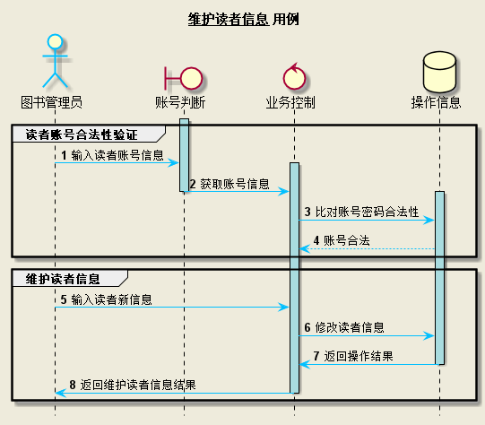
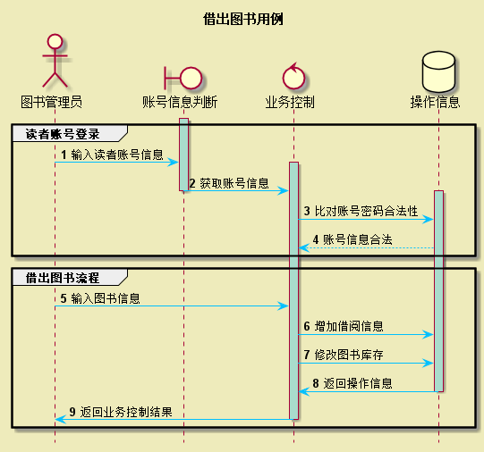
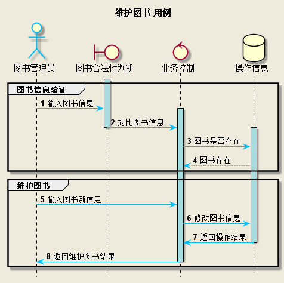
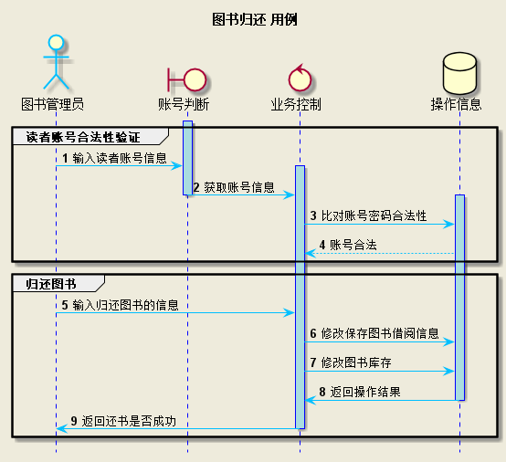
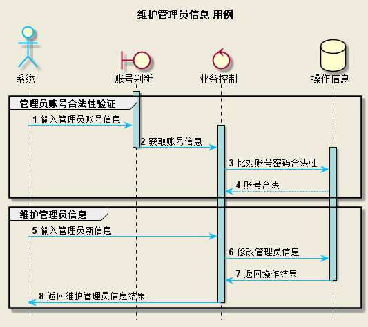
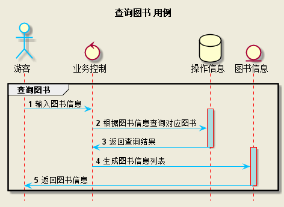
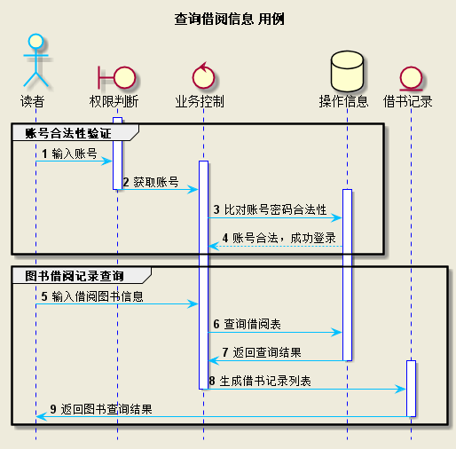
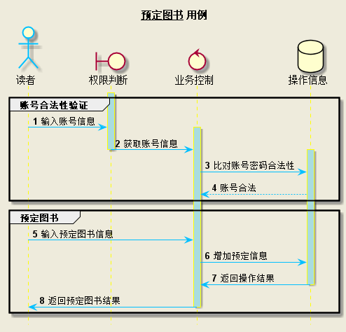
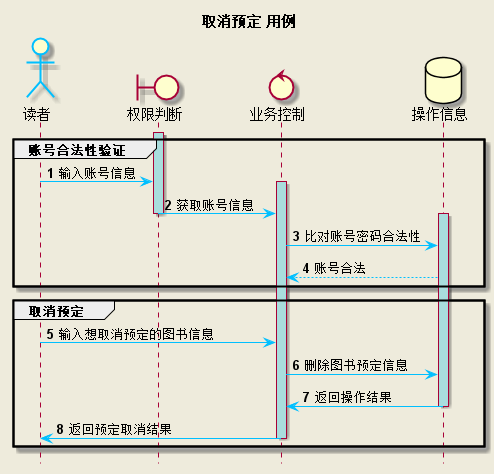

## 实验四：图书管理系统的顺序图

|学号|班级|姓名|
|:---------------:|:------------:|:------------:|
|201510414104|2015级软工1班|陈相镇|

### 1.读者信息安全维护

**PlantUML源码**
~~~
@startuml
skinparam backgroundColor #EEEBDC
skinparam handwritten true

skinparam sequence {
	ArrowColor DeepSkyBlue
	ActorBorderColor DeepSkyBlue
	LifeLineBorderColor blue
	LifeLineBackgroundColor #A9DCDF
	
	ParticipantBorderColor DeepSkyBlue
	ParticipantBackgroundColor DodgerBlue
	ParticipantFontName Impact
	ParticipantFontSize 17
	ParticipantFontColor #A9DCDF
	
	ActorBackgroundColor aqua
	ActorFontColor DeepSkyBlue
	ActorFontSize 17
	ActorFontName Aapex
}

hide footbox
title __维护读者信息__ 用例
actor 图书管理员 
boundary 账号判断
control 业务控制
database 数据库

autonumber
group 读者账号合法性验证
activate 账号判断
	图书管理员 -> 账号判断 :  输入读者账号信息
	activate 业务控制
		账号判断 -> 业务控制 : 获取账号信息
deactivate 账号判断
		activate 数据库
			业务控制 -> 数据库 : 比对账号密码合法性
			数据库 --> 业务控制 : 账号合法
end
group 维护读者信息
			图书管理员 -> 业务控制 : 输入读者新信息
			业务控制 -> 数据库 : 修改读者信息
			数据库 -> 业务控制 : 返回操作结果
		deactivate 数据库
	业务控制 -> 图书管理员 : 返回维护读者信息结果
	deactivate 业务控制
	

end

@enduml
~~~
##### 读者信息安全维护用例图

### 2.借出图书

**PlantUML源码**
~~~
@startuml
skinparam backgroundColor #EEEBDC
skinparam handwritten true

skinparam sequence {
	ArrowColor DeepSkyBlue
	ActorBorderColor DeepSkyBlue
	LifeLineBorderColor blue
	LifeLineBackgroundColor #A9DCDF
	
	ParticipantBorderColor DeepSkyBlue
	ParticipantBackgroundColor DodgerBlue
	ParticipantFontName Impact
	ParticipantFontSize 17
	ParticipantFontColor #A9DCDF
	
	ActorBackgroundColor aqua
	ActorFontColor DeepSkyBlue
	ActorFontSize 17
	ActorFontName Aapex
}

hide footbox
title __借出图书__ 用例
actor 图书管理员 
boundary 账号判断
control 业务控制
database 数据库

autonumber
group 读者账号合法性验证
activate 账号判断
	图书管理员 -> 账号判断 :  输入读者账号信息
	activate 业务控制
		账号判断 -> 业务控制 : 获取账号信息
deactivate 账号判断
		activate 数据库
			业务控制 -> 数据库 : 比对账号密码合法性
			数据库 --> 业务控制 : 账号合法
end
group 借出图书
			图书管理员 -> 业务控制 : 输入借出图书信息
			业务控制 -> 数据库 : 增加借阅信息
			业务控制 -> 数据库 : 修改图书库存
			数据库 -> 业务控制 : 返回操作结果
		deactivate 数据库
	业务控制 -> 图书管理员 : 返回借出结果
	deactivate 业务控制
	

end

@enduml
~~~
##### 借出图书用例顺序图

### 3.图书信息维护

**PlantUML源码**
~~~
@startuml
skinparam backgroundColor #EEEBDC
skinparam handwritten true

skinparam sequence {
	ArrowColor DeepSkyBlue
	ActorBorderColor DeepSkyBlue
	LifeLineBorderColor blue
	LifeLineBackgroundColor #A9DCDF
	
	ParticipantBorderColor DeepSkyBlue
	ParticipantBackgroundColor DodgerBlue
	ParticipantFontName Impact
	ParticipantFontSize 17
	ParticipantFontColor #A9DCDF
	
	ActorBackgroundColor aqua
	ActorFontColor DeepSkyBlue
	ActorFontSize 17
	ActorFontName Aapex
}

hide footbox
title __维护图书__ 用例
actor 图书管理员 
boundary 图书合法性判断
control 业务控制
database 数据库

autonumber
group 图书信息合法性验证
activate 图书合法性判断
	图书管理员 -> 图书合法性判断 :  输入图书信息
	activate 业务控制
		图书合法性判断 -> 业务控制 : 获取图书信息
deactivate 图书合法性判断
		activate 数据库
			业务控制 -> 数据库 : 图书是否存在
			数据库 --> 业务控制 : 图书存在
end
group 维护图书
			图书管理员 -> 业务控制 : 输入图书新信息
			业务控制 -> 数据库 : 修改图书信息
			数据库 -> 业务控制 : 返回操作结果
		deactivate 数据库
	业务控制 -> 图书管理员 : 返回维护图书结果
	deactivate 业务控制
	

end

@enduml
~~~
**3.2 图书信息维护用例顺序图**

### 4.归还图书

**PlantUML源码**
~~~
@startuml
skinparam backgroundColor #EEEBDC
skinparam handwritten true

skinparam sequence {
	ArrowColor DeepSkyBlue
	ActorBorderColor DeepSkyBlue
	LifeLineBorderColor blue
	LifeLineBackgroundColor #A9DCDF
	
	ParticipantBorderColor DeepSkyBlue
	ParticipantBackgroundColor DodgerBlue
	ParticipantFontName Impact
	ParticipantFontSize 17
	ParticipantFontColor #A9DCDF
	
	ActorBackgroundColor aqua
	ActorFontColor DeepSkyBlue
	ActorFontSize 17
	ActorFontName Aapex
}

hide footbox
title __归还图书__ 用例
actor 图书管理员 
boundary 账号判断
control 业务控制
database 数据库

autonumber
group 读者账号合法性验证
activate 账号判断
	图书管理员 -> 账号判断 :  输入读者账号信息
	activate 业务控制
		账号判断 -> 业务控制 : 获取账号信息
deactivate 账号判断
		activate 数据库
			业务控制 -> 数据库 : 比对账号密码合法性
			数据库 --> 业务控制 : 账号合法
end
group 归还图书
			图书管理员 -> 业务控制 : 输入归还图书信息
			业务控制 -> 数据库 : 删除借阅信息
			业务控制 -> 数据库 : 修改图书库存
			数据库 -> 业务控制 : 返回操作结果
		deactivate 数据库
	业务控制 -> 图书管理员 : 返回归还结果
	deactivate 业务控制
	

end

@enduml
~~~
##### 归还图书用例顺序图

### 5.管理员维护

**PlantUML源码**
~~~
@startuml
skinparam backgroundColor #EEEBDC
skinparam handwritten true

skinparam sequence {
	ArrowColor DeepSkyBlue
	ActorBorderColor DeepSkyBlue
	LifeLineBorderColor blue
	LifeLineBackgroundColor #A9DCDF
	
	ParticipantBorderColor DeepSkyBlue
	ParticipantBackgroundColor DodgerBlue
	ParticipantFontName Impact
	ParticipantFontSize 17
	ParticipantFontColor #A9DCDF
	
	ActorBackgroundColor aqua
	ActorFontColor DeepSkyBlue
	ActorFontSize 17
	ActorFontName Aapex
}

hide footbox
title __维护管理员信息__ 用例
actor 超级管理员 
boundary 账号判断
control 业务控制
database 数据库

autonumber
group 管理员账号合法性验证
activate 账号判断
	超级管理员 -> 账号判断 :  输入管理员账号信息
	activate 业务控制
		账号判断 -> 业务控制 : 获取账号信息
deactivate 账号判断
		activate 数据库
			业务控制 -> 数据库 : 比对账号密码合法性
			数据库 --> 业务控制 : 账号合法
end
group 维护管理员信息
			超级管理员 -> 业务控制 : 输入管理员新信息
			业务控制 -> 数据库 : 修改管理员信息
			数据库 -> 业务控制 : 返回操作结果
		deactivate 数据库
	业务控制 -> 超级管理员 : 返回维护管理员信息结果
	deactivate 业务控制
	

end

@enduml
~~~
**管理员维护用例顺序图**

### 6.查询图书

**PlantUML源码**
~~~
@startuml
skinparam backgroundColor #EEEBDC
skinparam handwritten true

skinparam sequence {
	ArrowColor DeepSkyBlue
	ActorBorderColor DeepSkyBlue
	LifeLineBorderColor blue
	LifeLineBackgroundColor #A9DCDF
	
	ParticipantBorderColor DeepSkyBlue
	ParticipantBackgroundColor DodgerBlue
	ParticipantFontName Impact
	ParticipantFontSize 17
	ParticipantFontColor #A9DCDF
	
	ActorBackgroundColor aqua
	ActorFontColor DeepSkyBlue
	ActorFontSize 17
	ActorFontName Aapex
}

hide footbox
title __查询图书__ 用例
actor 游客 
control 业务控制
database 数据库
entity 图书信息

autonumber

activate 业务控制
	游客 -> 业务控制 :  输入图书信息
		activate 数据库
			业务控制 -> 数据库 : 根据图书信息查询对应图书
			数据库 -> 业务控制 : 返回查询结果
		deactivate 数据库
		activate 图书信息
			业务控制 -> 图书信息 : 生成图书信息列表
		deactivate 业务控制
			图书信息 -> 游客	: 返回图书信息
		deactivate 图书信息

@enduml
~~~
##### 查询图书用例顺序图

### 7.查询借阅信息

**7.1 查询借阅信息用例PlantUML源码**
~~~
@startuml
skinparam backgroundColor #EEEBDC
skinparam handwritten true

skinparam sequence {
	ArrowColor DeepSkyBlue
	ActorBorderColor DeepSkyBlue
	LifeLineBorderColor blue
	LifeLineBackgroundColor #A9DCDF
	
	ParticipantBorderColor DeepSkyBlue
	ParticipantBackgroundColor DodgerBlue
	ParticipantFontName Impact
	ParticipantFontSize 17
	ParticipantFontColor #A9DCDF
	
	ActorBackgroundColor aqua
	ActorFontColor DeepSkyBlue
	ActorFontSize 17
	ActorFontName Aapex
}

hide footbox
title __查询借阅信息__ 用例
actor 读者 
boundary 权限判断
control 业务控制
database 数据库
entity 借书记录

autonumber
group 账号合法性验证
activate 权限判断
	读者 -> 权限判断 :  输入账号信息
	activate 业务控制
		权限判断 -> 业务控制 : 获取账号信息
deactivate 权限判断
		activate 数据库
			业务控制 -> 数据库 : 比对账号密码合法性
			数据库 --> 业务控制 : 账号合法
		
		
		
	

end
group 借书记录查询
	业务控制 -> 数据库 : 查询借阅表
	数据库 -> 业务控制 : 返回查询结果
	deactivate 数据库
	activate 借书记录
		业务控制 -> 借书记录 : 生成借书记录列表
	deactivate 业务控制
		借书记录 -> 读者 : 返回查询结果
	deactivate 借书记录
	

end

@enduml
~~~
##### 查询借阅信息用例顺序图

### 8.图书预定

**PlantUML源码**
~~~
@startuml
skinparam backgroundColor #EEEBDC
skinparam handwritten true

skinparam sequence {
	ArrowColor DeepSkyBlue
	ActorBorderColor DeepSkyBlue
	LifeLineBorderColor blue
	LifeLineBackgroundColor #A9DCDF
	
	ParticipantBorderColor DeepSkyBlue
	ParticipantBackgroundColor DodgerBlue
	ParticipantFontName Impact
	ParticipantFontSize 17
	ParticipantFontColor #A9DCDF
	
	ActorBackgroundColor aqua
	ActorFontColor DeepSkyBlue
	ActorFontSize 17
	ActorFontName Aapex
}

hide footbox
title __预定图书__ 用例
actor 读者 
boundary 权限判断
control 业务控制
database 数据库

autonumber
group 账号合法性验证
activate 权限判断
	读者 -> 权限判断 :  输入账号信息
	activate 业务控制
		权限判断 -> 业务控制 : 获取账号信息
deactivate 权限判断
		activate 数据库
			业务控制 -> 数据库 : 比对账号密码合法性
			数据库 --> 业务控制 : 账号合法
end
group 预定图书
			读者 -> 业务控制 : 输入预定图书信息
			业务控制 -> 数据库 : 增加预定信息
			数据库 -> 业务控制 : 返回操作结果
		deactivate 数据库
	业务控制 -> 读者 : 返回预定图书结果
	deactivate 业务控制
	

end

@enduml
~~~
##### 图书预定用例顺序图

### 9.取消预定图书

**PlantUML源码**
~~~
@startuml
skinparam backgroundColor #EEEBDC
skinparam handwritten true

skinparam sequence {
	ArrowColor DeepSkyBlue
	ActorBorderColor DeepSkyBlue
	LifeLineBorderColor blue
	LifeLineBackgroundColor #A9DCDF
	
	ParticipantBorderColor DeepSkyBlue
	ParticipantBackgroundColor DodgerBlue
	ParticipantFontName Impact
	ParticipantFontSize 17
	ParticipantFontColor #A9DCDF
	
	ActorBackgroundColor aqua
	ActorFontColor DeepSkyBlue
	ActorFontSize 17
	ActorFontName Aapex
}

hide footbox
title __取消预定__ 用例
actor 读者 
boundary 权限判断
control 业务控制
database 数据库

autonumber
group 账号合法性验证
activate 权限判断
	读者 -> 权限判断 :  输入账号信息
	activate 业务控制
		权限判断 -> 业务控制 : 获取账号信息
deactivate 权限判断
		activate 数据库
			业务控制 -> 数据库 : 比对账号密码合法性
			数据库 --> 业务控制 : 账号合法
end
group 取消预定
			读者 -> 业务控制 : 输入取消预定的图书信息
			业务控制 -> 数据库 : 删除预定信息
			数据库 -> 业务控制 : 返回操作结果
		deactivate 数据库
	业务控制 -> 读者 : 返回取消预定结果
	deactivate 业务控制
	

end

@enduml
~~~
##### 取消预定图书用例顺序图

