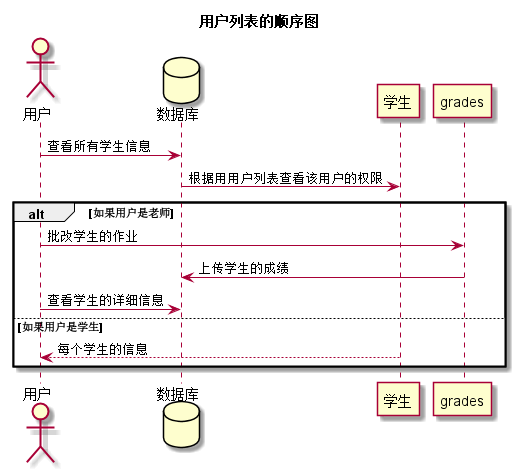

用户列表用例
--
[点击返回](..\README.md)

1 用户规约
---
|用例名称|用户列表|
|:-----:|:----:|
|功能|单独显示学生的信息，可通过点击github用户名，进入其github页面|
|事件参与者|学生或老师|
|前置条件|用户登录成功，进入用户首页|
|后置条件|成功返回到用户首页页面|
|主流事件|1.显示学生的信息；|
|备选流事件|无|

2 业务流程
---

3 界面设计
---
 * 界面参照：[点击](https://chenxiangz.github.io/is_analysis/FinalTest/ui/用户列表.html)
 * API接口
    * 接口1：[点击](../接口/getStuInfor.md)

4 算法描述
---

5 参照表
---

 * 学期表：[点击查看](../数据库设计/学期表.md)
 * 学生表：[点击查看](../数据库设计/学生表.md)
 * 实验表：[点击查看](../数据库设计/实验表.md)
 * 成绩表：[点击查看](../数据库设计/成绩表.md)
 * 教师表：[点击查看](../数据库设计/教师表.md)
 * 班级表：[点击查看](../数据库设计/班级表.md)
 * 管理员：[点击查看](../数据库设计/管理员.md)
 * 课程表：[点击查看](../数据库设计/课程表.md)