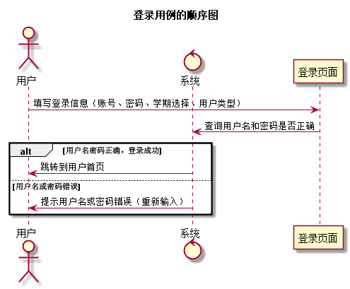
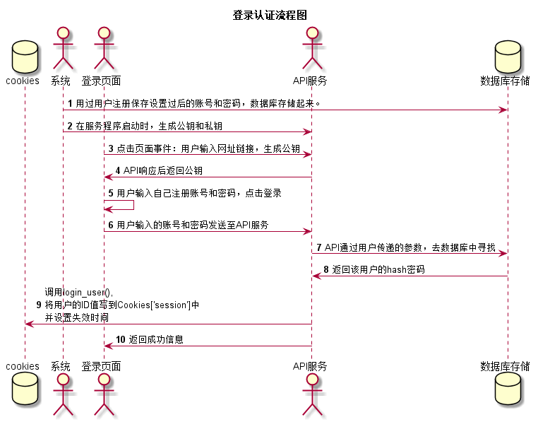

登录用例
-----------------------------------------------------------------
 [点击返回](../README.md)

 1 用例规约
-------
|用例名称|登录|
|:---:|:---:|
|事件参与者|学生、老师|
|前置条件| |
|后置条件|登录成功后，跳转到用户首页|
|主事件流|1. 访客输入用户名和密码，选择用户类型,选择学期  2.系统判断用户名，密码，用户类，学期正确，允许登录 3.系统在客户端以Cookie形式存储登录用户信息，保持登录的持久性。|
|备选事件流|1a. 输入的用户名或者密码为空   1.提示重新输入  2.访客重新提交登录信息  2a.系统判断用户名，密码，用户类不正确，不允许登录  1.提示重新输入  2.访客重新提交登录信息|

2 业务流程
------

3 界面设计
------
* 界面参照：[点击](https://chenxiangz.github.io/is_analysis/FinalTest/ui/登录.html)
* API接口调用：
    * [点击](../接口/login.md)

4 算法描述
-------------

5 参照表
-----

   * 学期表：[点击查看](../数据库设计/学期表.md)
   * 学生表：[点击查看](../数据库设计/学生表.md)
   * 实验表：[点击查看](../数据库设计/实验表.md)
   * 成绩表：[点击查看](../数据库设计/成绩表.md)
   * 教师表：[点击查看](../数据库设计/教师表.md)
   * 班级表：[点击查看](../数据库设计/班级表.md)
   * 管理员：[点击查看](../数据库设计/管理员.md)
   * 课程表：[点击查看](../数据库设计/课程表.md)

