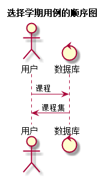

选课用例
----
[点击返回](..\README.md)

1 用例规约
------
|用例名称|选课用例|
|:---:|:---|
|功能|学生选择部分的实验课程项目|
|参与者|学生|
|前置条件|学生Github账号登录成功，进行实验选择|
|后置条件|选择课程成功后，页面跳转至学生用户首页|
|主流事件|学生自主选择老师安排的实验内容方向|
|备选流事件|1.学生选课失败，点击取消按钮，页面刷新。|

2 业务流程
------

3 界面设计
------
 * 界面参照：[点击](https://chenxiangz.github.io/is_analysis/FinalTest/ui/选课.html)
 * API接口：
    * 接口：[点击](../接口/choiceCourse.md)

4 算法描述
------

5 参照表
-----

 * 学期表：[点击查看](../数据库设计/学期表.md)
 * 学生表：[点击查看](../数据库设计/学生表.md)
 * 实验表：[点击查看](../数据库设计/实验表.md)
 * 成绩表：[点击查看](../数据库设计/成绩表.md)
 * 教师表：[点击查看](../数据库设计/教师表.md)
 * 班级表：[点击查看](../数据库设计/班级表.md)
 * 管理员：[点击查看](../数据库设计/管理员.md)
 * 课程表：[点击查看](../数据库设计/课程表.md)